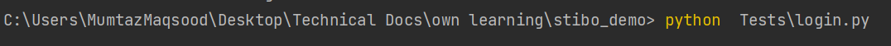
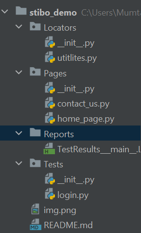
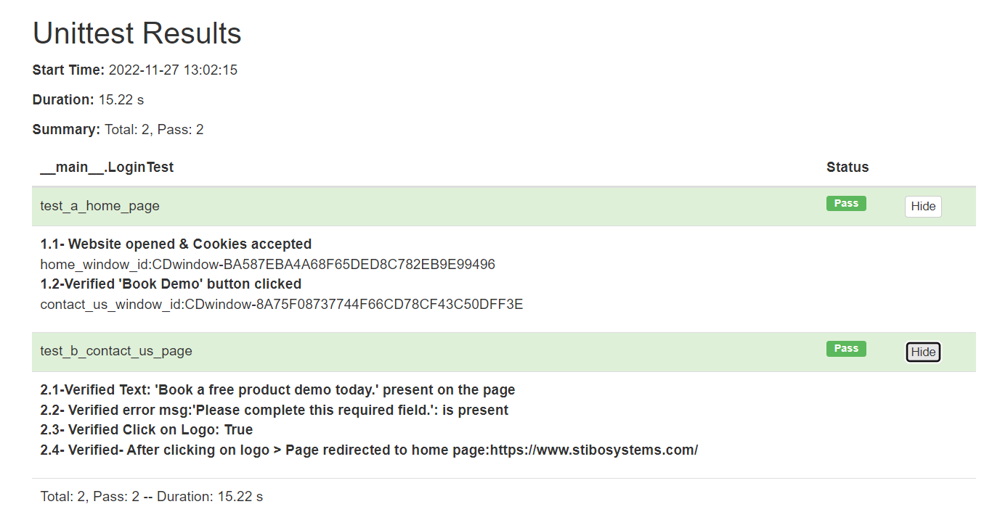

# Stibo_demo
    This solution is implemented by using 
    --> Python
    --> selenium + unittest framework
    --> for reporting --> used html reports 

# How to execute 
    1- install python 
    2- install selenium, html reports, unittest framework 
        --> pip install selenium
        --> pip install html-testRunner
        --> pip install unittest
        --> pip install webdriver_manager 
    
    3- **If chrome browser is not working after installing the above package then**
        **Download the chrome webdriver and put it in your PYTHON's libs folder**
        fx "C:\\python310\\libs\\chromedriver.exe"
        download from here according to your chrome version
        https://chromedriver.chromium.org/downloads
    4- Execute Test cmd

# Project Structure 

# Description
    Try to implement the POM (Page Object Model) but its basic structure
    of POM, pages, test & utility functions and reports are in different folder
    There is still possiblity to optimize and refactor the code. 
    **CONTACT ME. IF THERE IS PROBLEM IN CONFIGURATION**

# Covered Areas
    1 Go to https://www.stibosystems.com/
    2 Click 'BOOK A DEMO' button.
    3 In newly open window check that there is a text 'Book a free product demo today.'.
    4 Type text in 'Your message' field.
    5 Select option in 'Country' dropdown.
    6 Click 'Send' button.
    7 Check that 'Please complete this required field.' error message under "Last name" field is displayed.
    8 Click on Stibo Systems logo.
    9 Check that you are back on home page.

# What is not covered
    NA

# Reports 

